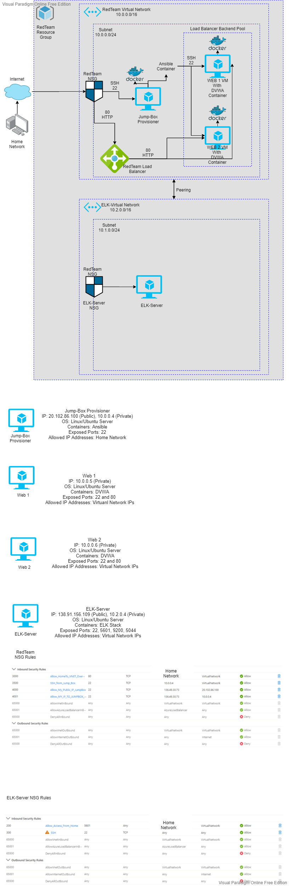
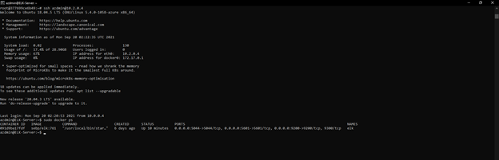

## Automated ELK Stack Deployment

The files in this repository were used to configure the network depicted below.

These files have been tested and used to generate a live ELK deployment on Azure. They can be used to either recreate the entire deployment pictured above. Alternatively, select portions of the `YAML` file may be used to install only certain pieces of it, such as Filebeat.

  https://github.com/ianrodenbaugh/Cloud-Network-Implementation-Project/blob/79af55d9a6370eb0379aa6d736bbe41cba7fdb57/Ansible/filebeat-config.yml

This document contains the following details:
- Description of the Topologu
- Access Policies
- ELK Configuration
  - Beats in Use
  - Machines Being Monitored
- How to Use the Ansible Build

### Description of the Topology

The main purpose of this network is to expose a load-balanced and monitored instance of DVWA, the D*mn Vulnerable Web Application.

Load balancing ensures that the application will be highly available and resisent to attacks such as a Denial-of-service attack (DDOS), in addition my Jump-Box Provisioner will restrict accesss to the network for only approved IPs.

The use of the ELK server allows for easy monitering of the VMs, such as viewing any changes in web traffic and viewing any changes in the system log files. Filebeat monitors the log files or locations that are specified. It collects, logs events, and forwards information for review. Metricbeat helps monitor the server by collecting metrics from the system and services running on the server.

The configuration details of each machine may be found below.

| Name     | Function | IP Address | Operating System   |
|----------|----------|------------|------------------  |
| Jump Box | Gateway  | 10.0.0.4   | Linux(Ubuntu 18.04) |
| Web-1     | Webserver          | 10.0.0.5            | Linux(Ubuntu 18.04) |
| Web-2     | Webserver          | 10.0.0.6            | Linux(Ubuntu 18.04) |
| ELK-Server | Webserver  | 10.2.0.4          |Linux(Ubuntu 18.04)      |

### Access Policies

The machines on the internal network are not exposed to the public Internet. 

Only the Jump-Box Provisioner machine can accept connections from the Internet. Access to this machine is only allowed from the `Home Network IP Adress`

Machines within the network can only be accessed by the `Jump-Box Provisioner (10.0.0.4)`.

A summary of the access policies in place can be found in the table below.

| Name     | Publicly Accessible | Allowed IP Addresses |
|----------|---------------------|----------------------|
| Jump Box | Yes              | Home Network IP Adress    |
| Web-1         | No                    |  10.0.0.4                     |
| Web-2         |   No                  |         10.0.0.4             |
| ELK-Server         | No                     | Home Network IP Adress         |

### Elk Configuration

Ansible was used to automate configuration of the ELK machine. No configuration was performed manually, which is advantageous because this allows you to configure as many machines as you would like simultaneously.

The playbook implements the following tasks:

- Install docker.io using the apt module.
- Install python3-pip using the apt module.
- Install docker module using the pip module.
- Increase virtual memory (command: `sysctl -w vm.max_map_count=262144`) and use `sysctl` module to provide the value of desired memory to use.
- Download and launch a docker elk container using the `docker_container` module.

The following screenshot displays the result of running `docker ps` after successfully configuring the ELK instance.

### Target Machines & Beats
This ELK server is configured to monitor the following machines:
- Web-1 Webserver `(10.0.0.5)
- Web-2 Webserver `(10.0.0.6)

We have installed the following Beats on these machines:
- Filebeat
- Metricbeat

These Beats allow us to collect the following information from each machine:
- Filebeat is a lightweight shipper for forwarding and centralizing log data. Installed as an agent on your servers, Filebeat monitors the log files or locations that you specify, collects log events, and forwards them either to Elasticsearch or Logstash for indexing.

- Metricbeat is a lightweight shipper that you can install on your servers to periodically collect metrics from the operating system and from services running on the server. Metricbeat takes the metrics and statistics that it collects and ships them to the output that you specify, such as Elasticsearch or Logstash.

### Using the Playbook
In order to use the playbook, you will need to have an Ansible control node already configured. Assuming you have such a control node provisioned: 

SSH into the control node and follow the steps below:
- Copy the `Elk-playbook.yml` file to `/etc/ansible/roles/"(Which ever file you have for ELK)"`. Repeat process for Filebeat playbook and Metricbeat playbook.
- Update the `/ect/asnible/hosts`  file to include  the webserver and include [Elk], and the Elk-Server IP address: `10.2.0.4` followed by `ansible_python_interpreter=usr/bin/python3`.
- Run the playbook, and navigate to ansible-playbook `Elk-playbook.yml`. To check that the installation worked as expected in a new search bar type in: (http://"(Your-elk-server-ip":5601. Image below shows the Elk server working as expected. 

